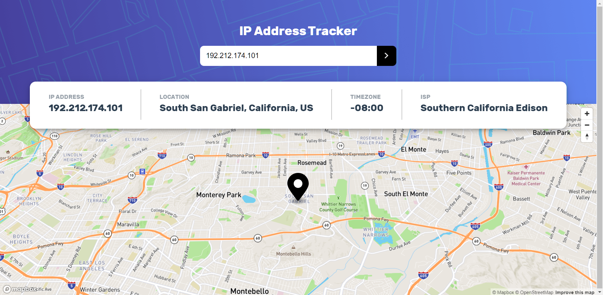

# ip-address-tracker



Hello! This is my solution to IP Address Tracker site - Frontend Mentor. This is my second project build with Vue JS. This is the complete solution as per the challenge as I implemented all the mentioned feature. I didnt added the responsive design for mobile and hover states, under the hood logics are working fine and optimized few bugs.

## Challenge

    Your challenge is to build out this IP Address Tracker app and get it looking as close to the design as possible. To get the IP Address locations, you'll be using the IP Geolocation API by IPify. To generate the map, we recommend using LeafletJS.

You can use any tools you like to help you complete the challenge. So if you've got something you'd like to practice, feel free to give it a go.

Your users should be able to:

- View the optimal layout for each page depending on their device's screen size
- See hover states for all interactive elements on the page
- See their own IP Address on the map on the initial page load
- Search for any IP addresses or domains and see the key information and location

## Tech Stack

### Frontend

- VUE JS
- Javascript
- Semantic HTML5 markup
- Styled-components

### API

- Mapbox API
- IPIFY

## Links

- [Checkout the live preview of website](https://ip-address-tracker-mayankj.netlify.app/ "Website Preview")
- [Front-End Mentor challenge page](https://www.frontendmentor.io/challenges/ip-address-tracker-I8-0yYAH0 "Challenge link")

## Project setup

```
npm install
```

### Compiles and hot-reloads for development

```
npm run serve
```

### Compiles and minifies for production

```
npm run build
```

### Customize configuration

See [Configuration Reference](https://cli.vuejs.org/config/).
